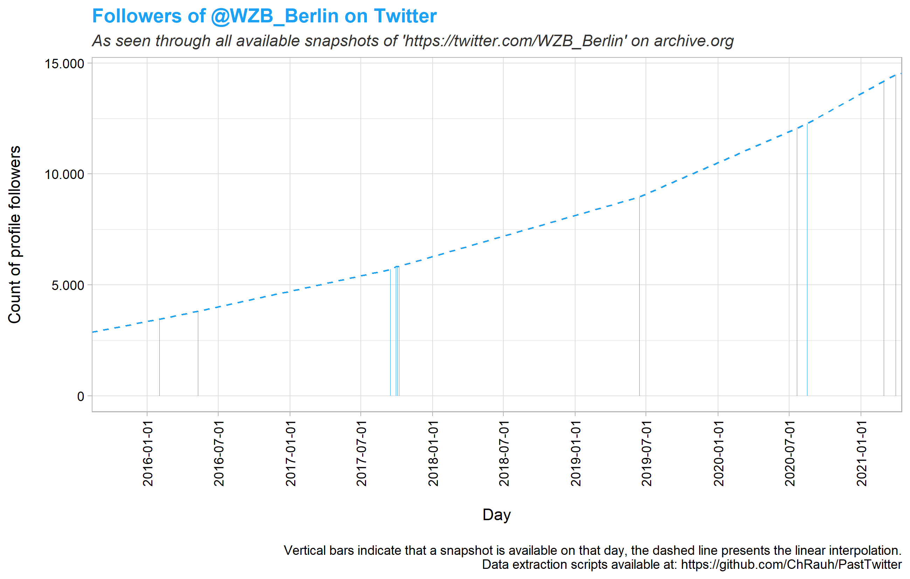

# PastTwitter
Some R functions to scrape and plot Twitter account info for past points in time from [web.archive.org](http://web.archive.org/) snapshots. 

Author: [ChRauh](http://www.christian-rauh.eu) 
   
---  

- [PastTwitter](#pasttwitter)
    + [`handleSnapshots()`](#-handlesnapshots---)
    + [`extractAccountInfo()`](#-extractaccountinfo---)
    + [`plotFollowers()`](#-plotfollowers---)
    + [Example application](#example-application)
    + [Example output](#example-output)
    + [Dependencies](#dependencies)
  
--- 

### `handleSnapshots()`

*Input*  
String containing a single Twitter handle, without '@' or URL. Examples: 'realDonaldTrump', 'vonderleyen', 'GretaThunberg' 

*Output*  
R data.frame object containing links to all valid (status = 200, text/html available) web.archive.org snapshots for the Twitter profile page of the provided handle with timestamps. If multiple snapshots exist for the same day, only the first of those is kept.
   
   
--- 

### `extractAccountInfo()`

*Input*  
R data.frame object as structured by `handleSnapshots()`

*Output*  
R data.frame object containg the count of *followers*, *following*, *tweets*, and *likes* for each available snapshot.
   
   
--- 

### `plotFollowers()`

*Input*  
R data.frame object as structured by `extractAccountInfo()`.

*Output*  
A `ggplot()` object indicating profile follower count of the specified handle at each available web.archive.org snapshot via `geom_bar()` and the linear interpolation via `geom_line()`. 
  
  
--- 

### Example application 
 
 
```R
# Note: Execution time depends strongly on the number of available archive.org snapshots
# For the 'realDonaldTrump' example > 3h (2232 available snapshots on May 6 2021)
# Functions provide rudimentary progress feedback

# Attach PastTwitter functions ####
source("PastTwitter.R")

# The Twitter handle of interest ####
handle <- "realDonaldTrump"

# Output params
datafile <- paste0("./data/", handle, ".RDS")
plotfile <- paste0("./plots/", handle, ".png")

# Get archive.org snapshots ####
snapshots <- handleSnapshots(handle)

# Extract account info ####
info <- extractAccountInfo(snapshots)

# Plot follower count ####
pl.f <- plotFollowers(info)

# Export ####
write_rds(info, datafile)
ggsave(plotfile, pl.f, width = 22, height = 14, units = "cm")

```
 
 
--- 

### Example output
  
  
   

  
  
  
    

  
---
### Dependencies
  * [tidyverse](https://cran.r-project.org/web/packages/tidyverse/index.html) (>= 1.3.0) 
  * [rjson](https://cran.r-project.org/web/packages/rjson/index.html) (>= 0.2.20) 
  * [rvest](https://cran.r-project.org/web/packages/rvest/index.html) (>= 0.3.6) 
  * [[httr](https://cran.r-project.org/web/packages/httr/index.html) (>= 1.4.2)]  

